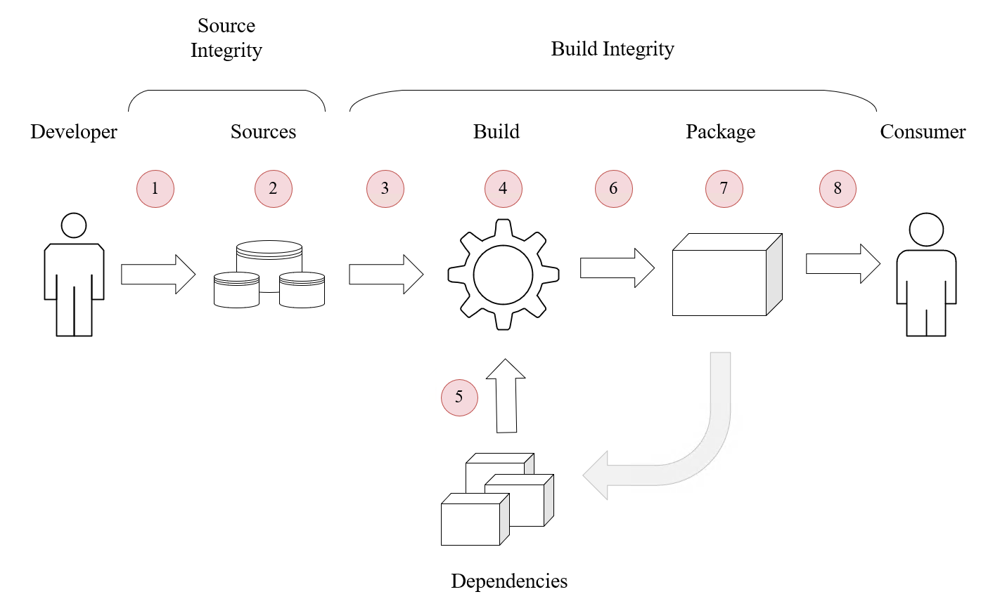
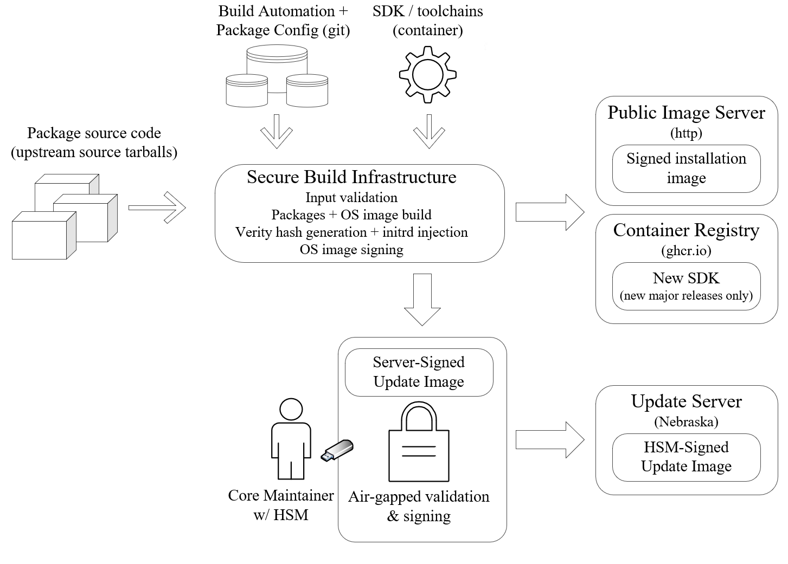
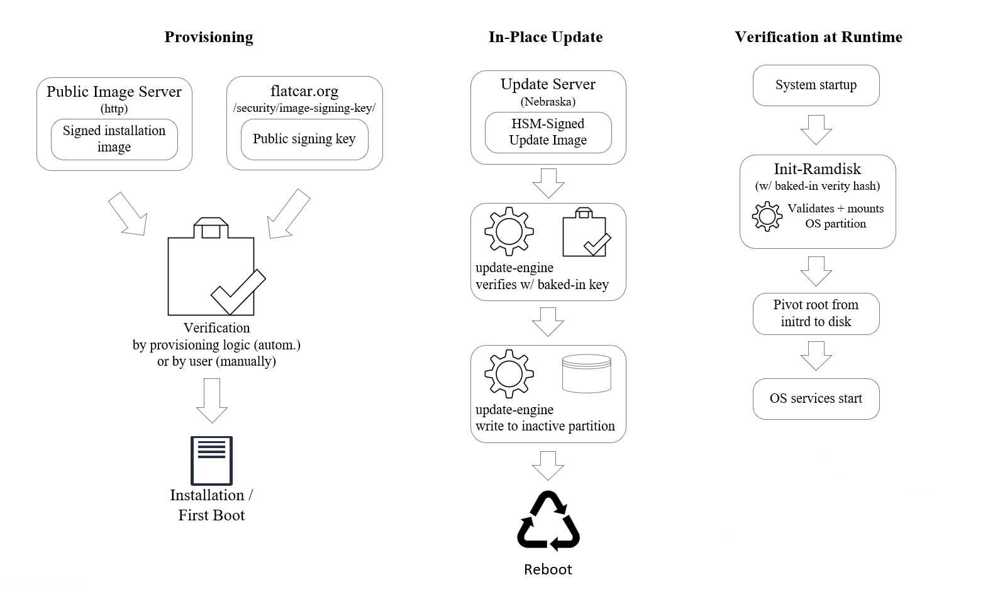

### Flatcar Container Linux Supply Chain Security and SLSA

The [Supply Chain Levels for Software Artifacts](https://slsa.dev/) (SLSA or 'salsa' for short) industry standard defines a checklist of standards and controls to prevent tampering, improve integrity, and secure packages and infrastructure in software projects.
This document describes the Flatcar Container Linux project's current and planned compliance with the [requirements of SLSA](https://slsa.dev/spec/v0.1/requirements) and provides a deep dive into the processes and mechanisms to secure the Flatcar project supply chain.

Our assessment is that Flatcar complies with SLSA Level 3. We are working to address the few remaining requirements for SLSA Level 4.

#### SLSA Threat model and requirements

SLSA defines a number of [key threats](https://slsa.dev/spec/v0.1/#supply-chain-threats) against supply chains:
1. unauthorised changes to sources
2. compromised source repositories
3. builds from a modified source
4. a compromised build process
5. use of a compromised dependency
6. publishing of a compromised package or image
7. a compromised package or image repository
8. injection / use of a compromised package or image

To counter these threats, SLSA defines [requirements](https://slsa.dev/spec/v0.1/requirements) for sources, builds, and provenance, as well as common (overall) requirements.

##### Table of SLSA requirements and conformance levels, and Flatcar's compliance

This following table summarizes the requirements of each SLSA level, and Flatcar's current state of compliance.

|                SLSA requirement                   | SLSA level 1 | SLSA level 2 | SLSA level 3 | SLSA level 4 | Flatcar meets |
|---------------------------------------------------|--------------|--------------|--------------|--------------|---------------|
| Source integrity: Source is version controlled    |              |       ✓      |      ✓       |      ✓       |       ✓       |
| Source integrity: Source has verified history     |              |              |      ✓       |      ✓       |       ✓       |
| Source integrity: Source is retained indefinitely |              |              |  18 months   |      ✓       |       ✓       |
| Source integrity: Source is two-person reviewed   |              |              |              |      ✓       |       ✓       |
| Build integrity: Scripted build                   |       ✓      |       ✓      |      ✓       |      ✓       |       ✓       |
| Build integrity: Build service is used            |              |       ✓      |      ✓       |      ✓       |       ✓       |
| Build integrity: Build as code                    |              |              |      ✓       |      ✓       |       ✓       |
| Build integrity: Built in ephemeral environment   |              |              |      ✓       |      ✓       |       ✓       |
| Build integrity: Isolated                         |              |              |      ✓       |      ✓       |       ✓       |
| Build integrity: Parameterless                    |              |              |              |      ✓       |       ✓       |
| Build integrity: Hermetic                         |              |              |              |      ✓       |       – [1]   |
| Build integrity: Reproducible                     |              |              |              | Best Effort  |       – [2]   |
| Provenance: Available                             |       ✓      |       ✓      |      ✓       |      ✓       |       ✓       |
| Provenance: Authenticated                         |              |       ✓      |      ✓       |      ✓       |       ✓       |
| Provenance: Service generated                     |              |       ✓      |      ✓       |      ✓       |       ✓       |
| Provenance: Non-falsifiable                       |              |              |      ✓       |      ✓       |       ✓       |
| Provenance: Dependencies complete                 |              |              |              |      ✓       |       ✓       |
| Common - Security                                 |              |              |              |      ✓       |       – [3]   |
| Common - Access                                   |              |              |              |      ✓       |       ✓       |
| Common - Superusers                               |              |              |              |      ✓       |       – [4]   |

**Notes**

1. Build integrity - Hermetic builds: While Flatcar includes the potential for hermetic builds today - all sources are known in advance and can be staged to a build machine isolated from the network - the current build infrastructure and automation does not implement this feature.
   A [tracking issue](https://github.com/flatcar-linux/Flatcar/issues/833) exists to address this in the future.
2. Build integrity - Reproducible: Many software packages such as compilers and core libraries insert build-variable information such as timestamps, user IDs, and host names into their binaries during the build process.
   While Flatcar's builds are 100% reproducible, the output may differ in a bit-by-bit comparison (as defined by SLSA) ONLY in places where this volatile information is compiled into the binaries.
3. Common - Security: The SLSA requirement is TBD, hence not well defined.
   Flatcar builds run on Flatcar, so runtime the integrity check mechanisms discussed below (immutable OS partition validated at boot via `dm-verity`) apply to the build infrastructure.
   However, the infrastructure does not implement a full chain of trust via TPM, though a [roadmap item](https://github.com/flatcar-linux/Flatcar/issues/630) aims to add TPM support to Flatcar, and hence to the build infrastructure.
4. Common - Superusers: The number of users with direct access to build infrastructure is very small, and users are well trusted.
   However, changes to the build system do not enforce approval by a second administrator.

### Deep dive: Implementation in Flatcar Container Linux

Flatcar Container Linux employs a number of concrete mechanisms and processes to secure its supply chain.

Broadly speaking, these break down into two areas:
1. Mechanisms and processes to ensure validity of the Flatcar artifacts that make up release images.
   Attestation is performed either automatically by the build system or by the maintainers team.
   This includes validating the build pipeline's inputs / upstreams, securing the build process, and ensuring attestability of the resultant images and update payloads.
2. Mechanisms and processes to be applied at provisioning time by users, as well as automatically at runtime, attesting validity of the artifacts in use.
   Attestation is performed either automatically by the provisioning logic of Flatcar OS / client services or by users.
   This includes validating signatures of Flatcar images by end users (or their provisioning automation), validating update payloads by the Flatcar update client, and verifying integrity during the boot process.

#### Foundation

Flatcar builds its supply chain security on a number of basic concepts which, in summary, provide the foundation for securing the entire Flatcar supply chain.
These foundational concepts fall into one of the two areas outlined above.

The build-time / release-time foundational concepts are:
1. We always build from source.
   All our artifacts are built from source; no pre-generated binaries are used.
   Builds are performed by a validated SDK which is the result of a previous, validated, build.
2. We ship whole OS images only; no incremental updates or upgrades of individual OS binaries or packages are supported.
   Installation images are shipped as full disk images, including partitioning.
   Updates are shipped as full partition images; an A/B OS partition scheme is employed for installing and for activating the update.

The provisioning-time / OS upgrade / runtime foundational concepts are:
1. Installation images contain a full, pre-partitioned disk including the full OS.
   No additional OS binaries or packages are installed during or after provisioning.
   (The root partition, which does not contain OS artifacts, is resized to span the whole disk at provisioning time for user convenience.)
2. All OS binaries and libraries reside on a separate _read-only_ partition (mounted to `/usr` at runtime).
   The partition cannot be written to.

#### Flatcar supply chain security mechanisms

Flatcar builds its supply chain security on the foundational concepts outlined above.
In this section we will discuss the overall Flatcar build and release process as well as user-side provisioning, update, and operation - with a special focus on read models and supply chain security.

##### OS Image build and release of a new OS version

Flatcar builds are reproducible; the software configuration state of any given release (or even nightly build) is recorded in git repositories and can be reproduced by a simple git clone + checkout + rebuild.
We employ a number of mechanisms to make this process tamper-proof and to make artifacts we produce attestable.
Please note that while builds are reproducible and will create the same binary code, the output may differ in a bit-by-bit comparison in places where volatile information like timestamps, hostnames, or user IDs are inserted at build time.

Flatcar release images and related artifacts are automatically signed at build time (on the secure build infrastructure) with a 4096 bit GPG RSA key.
Access to the image signing key is restricted to core maintainers.
The image signing key is always stored encrypted and has a lifetime of one year.
Renewing the image signing key requires split secrets of multiple maintainers.

###### Inputs
1. Flatcar's build automation and package definition repositories.
   Write access to repositories is limited to trusted group of core Flatcar maintainers (the @flatcar-linux/flatcar-maintainers team in the flatcar-linux github org).
   All changes are reviewed by at least one maintainer before merge.
   1. A [top-level build automation repo](https://github.com/flatcar-linux/scripts).
      This repository qualifies automation and package definitions of any given build by commit ID.
   2. Package definition (ebuild) repositories "pinned" as git submodules to a commit in the build automation repo.
      Package definitions include the [coreos-overlay](https://github.com/flatcar-linux/coreos-overlay) and [portage-stable](https://github.com/flatcar-linux/portage-stable) repositories.
2. Upstream source tarballs of applications and libraries shipped with Flatcar.
   Secured by cryptographic checksums stored in Flatcar's build automation repos (Gentoo standard).
3. The SDK container.
   The container is the result of a previous build and is validated by its container registry checksum.

###### Process

The OS image (and optionally, SDK) build and artifact signing is performed on a dedicated machine (not a VM) in a secure, access-controlled Equinix Metal data center.
Access to the infrastructure is limited to a small number of core maintainers - a subset of the Flatcar maintainers team - and is reviewed regularly.
Access is only possible via a VPN (not via public internet) and is verified with SSH keys.
The build process entails:

1. Cloning of Flatcar build automation (git repo) and package definitions / configurations (ebuilds in git repos / submodules to build automation repo).
2. Fetching of source tarballs of apps and libraries that make up the OS image.
   Integrity of source tarballs is validated against multiple cryptographic checksums stored in package definition (ebuild) repos.
3. Building of apps and libraries, and generation of installation images and update image.
   **During the build of each package, per-package SLSA provenance for most OS image packages is generated.**
   Optionally, a new SDK is built prior to the OS apps and libs.
   Full SDK rebuilds are usually done only for new major Alpha releases.
   **During the SDK build, per-package SLSA provenance for core libraries and toolchains is generated.**
   In rare circumstances, changes to toolchains and/or core libraries would mandate an SDK rebuild.
   In that case a new SDK is published alongside the respective Flatcar Beta / Stable release.
   **Note** that we track a number of feature requests to further improve SLSA provenance generation:
   1. Add builder ID information during CI builds: [tracking issue](https://github.com/flatcar-linux/Flatcar/issues/813)
   2. Generate additional provenance for the whole image: [tracking issue](https://github.com/flatcar-linux/Flatcar/issues/814)
4. Signing of artifacts to enable validation of authenticity at provisioning time.
   Signing also ensures SLSA provenance is non-falisfiable.
   1. A verity hash of the OS partition is generated and injected into the initrd so Flatcar can verify tamper-free OS partition at boot time.
   2. There is an extra layer of security for the update image.
      Many Flatcar deployments use automated updates so special care is take to ensure these are not compromised.
      A core maintainer downloads the update image from the secure build server, and validates the image and its server signature.
      The image is then signed with a key stored on a ardware security module (HSM), in an air-gapped environment so the key is never exposed to the internet.

###### Outputs

After image builds conclude, OS images, update image, related artifacts and signature files reside on the secure build infrastructure and are ready for publishing.
Access to the public image and update servers is limited to a subset of the Flatcar maintainers team.
Accounts with access to the update server use 2-factor authentication.

1. Artifacts and signatures are uploaded from the secure build infrastructure to the public image server.
   The SDK container (if applicable) is pushed to the container registry (Flatcar uses GHCR at the time of writing).
2. The update image and its (manually generated) signature are uploaded to the update server by the person who performed the manual signing step.
3. Per-package SLSA provenance is shipped within the image at `/usr/share/SLSA/`.

##### Provisioning-time / OS upgrade / run-time

Flatcar ships with a number of mechanisms to attest the authenticity of artifacts consumed both when provisioning and when updating Flatcar.
Further, Flatcar assesses the authenticity of all OS binaries - which reside on a separate, read-only partition - at each boot.

###### Validation at provisioning time

The public key component of the Flatcar image signing key (see above) is [available from the Flatcar website](https://www.flatcar.org/security/image-signing-key/) for verification. 
Using the public key, installation images can be validated against their signatures before provisioning, either manually by the user or (preferred) automatically by provisioning automation.
In either case the Flatcar project provides the means for validation, but executing the process is ultimately in the responsibility of the operator / user.
In other words, while strongly recommended, validation is not enforced by the distribution, i.e. there are no mechanisms in place which would prevent installation of an image that was not validated.
Installation automation provided by the Flatcar project (e.g. the [flatcar-install](https://github.com/flatcar-linux/init/blob/flatcar-master/bin/flatcar-install) script) will verify authenticity of installation images.

Each of the Flatcar installation images (for all supported vendors / platforms) are accompanied by
1. a `.DIGESTS` file which contains cryptographic hashes of the respective image
2. a `.DIGESTS.sig` file containing the signature and
3. a `.DIGESTS.asc` containing both cryptographic hashes as well as the ASCII-armored signature for convenience

Smaller artifacts, like text files containing the list of packages or the list of files contained in the OS image, do not ship with cryptographic hashes but are accompanied by `.sig` digital signature files directly.

###### Validation of OS partition at boot time

All operating system binaries are contained in a separate, immutable (read-only) partition which is mounted to `/usr` at system boot.
No OS binaries exist outside `/usr` and no individual files can be changed.
The OS partition is validated on each boot using `dm-verity`. The verity hash is baked into the init-rd at build time.

###### Validation of update images at OS upgrade time

Flatcar ships with a mechanism to auto-upgrade itself to new releases.
The client service, `update_engine`, is included in the OS partition of the Flatcar image, i.e. it is on a read-only, `dm-verity`-validated partition.
Before installation, update images are validated against the update signing key - this key has a separate, even stronger security process than the image signing key (see build process for details).
`update_engine` uses a baked-in public key for validation.
An update is installed only after successful validation.

### Future improvements

To further enhance attestability and supply chain security we consider the below (non-exhaustive) list of improvements for Flatcar in the future.

#### SLSA provenance

1. Add builder ID information during CI builds: [tracking issue](https://github.com/flatcar-linux/Flatcar/issues/813)
2. Generate additional provenance for the whole image: [tracking issue](https://github.com/flatcar-linux/Flatcar/issues/814)

#### Build time

1. Make release builds hermetic by providing all required assets beforehand and isolating the build machine from the network during build, to address the "Build integrity - Hermetic" requirement
   ([tracking issue](https://github.com/flatcar-linux/Flatcar/issues/833)).
2. Establish a secure boot chain using TPM support when it becomes available (see "Provisioning-time" item 2. below).
3. Remove login (local and remote) from build infrastructure and automate all build infra properties (infra-as-code).
   Require approval from 2 administrators for every change.

#### Provisioning-time / OS upgrade / run-time

1. Integrate with hardware TPM (where available) to secure the boot process right from hardware start-up instead of just from the initial ramdisk
   [roadmap issue](https://github.com/flatcar-linux/Flatcar/issues/630), addressing the "Common - Security" requirement.
