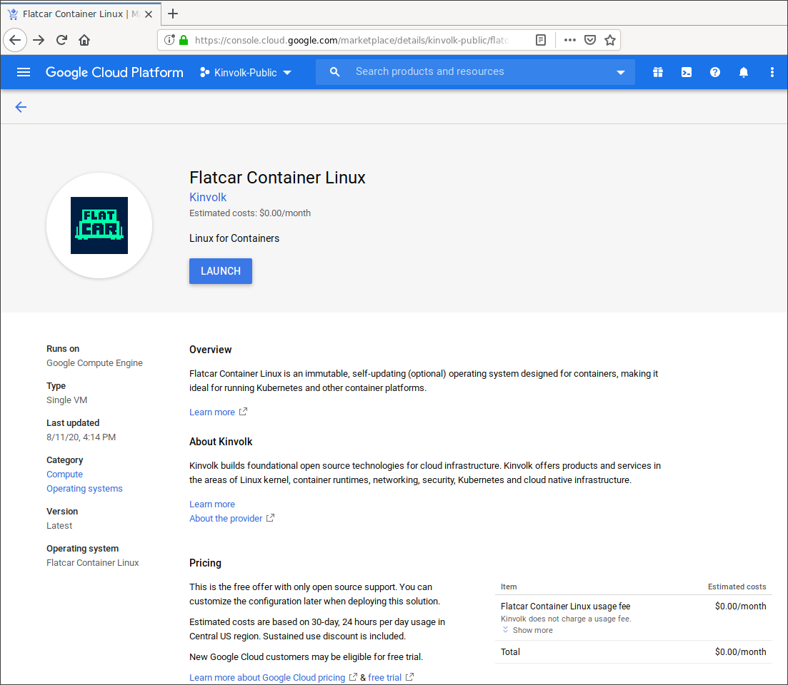

# Deploying Flatcar Container Linux using Google Cloud Launcher

You can deploy Flatcar Container Linux instances in a really easy way,
using the Google Cloud Launcher.  Before proceeding, you will need a GCE
account ([GCE free trial][free-trial]).

[free-trial]: https://cloud.google.com/free-trial/?utm_source=flatcar&utm_medium=partners&utm_campaign=partner-free-trial

To start the deployment, go to
<https://console.cloud.google.com/marketplace/details/kinvolk-public/flatcar-container-linux>



Click "Launch".


You can use the default values already filled in for you, or customize them
for your needs. When you're happy with the settings, click "Deploy"


And that's it! Your new Flatcar Container Linux is deploying.

## Inspecting your instance

When complete you should see:


Flatcar supports automatic resizing on first boot, the installation will
use all the available space. So, you can ignore the warning about the image
and disk mismatch.

## SSH and users

Users are added to Container Linux on GCE by any user provided
configuration (like ignition or cloudinit) and by either the GCE account
manager or [GCE OS
Login](https://cloud.google.com/compute/docs/instances/managing-instance-access).
OS Login is used if it is enabled for the instance, otherwise the GCE
account manager is used.

By default, the GCE account manager will provision the machine for the
username that matches your account.

### Using the web UI

The easiest way to launch an SSH client is directly from the web UI


This will connect with your user, which has some basic permissions. You
will be able to inspect the machine and have a look around.

To connect with the `core` user that can administer the whole machine, you
will need to connect using the `gcloud` command.

### Using OS Login

You can log in using your Google account on instances with OS Login
enabled. OS Login needs to be [enabled in the GCE
console](https://cloud.google.com/compute/docs/instances/managing-instance-access#enable_oslogin)
and on the instance. **It is enabled by default on instances provisioned with
Flatcar Container Linux**. Once enabled, you can log into your Container Linux
instances using:

```shell
gcloud compute ssh --zone us-central1-a <instance-name>
```

This will use your GCE user to log in.

### Using the GCE account manager

You can log in your Flatcar Container Linux instances from the command
line, using the `gcloud` command.

```shell
gcloud compute ssh --zone <instance-zone> core@<instance-name>
```

Users other than `core`, which are set up by the GCE account manager, may
not be a member of required groups. If you have issues, try running
commands such as `journalctl` with sudo.

#### Disabling OS Login on newly provisioned nodes

You can disable the OS Login functionality by masking the `oem-gce-enable-oslogin.service` unit:

```yaml
systemd:
  units:
    - name: oem-gce-enable-oslogin.service
      mask: true
```

When disabling OS Login functionality on the instance, it is also recommended to disable it in the GCE console.

## Using Flatcar Container Linux

Now that you have a machine booted it is time to play around. Check out the [Flatcar Container Linux Quickstart](quickstart) guide or dig into [more specific topics](https://docs.flatcar-linux.org).
